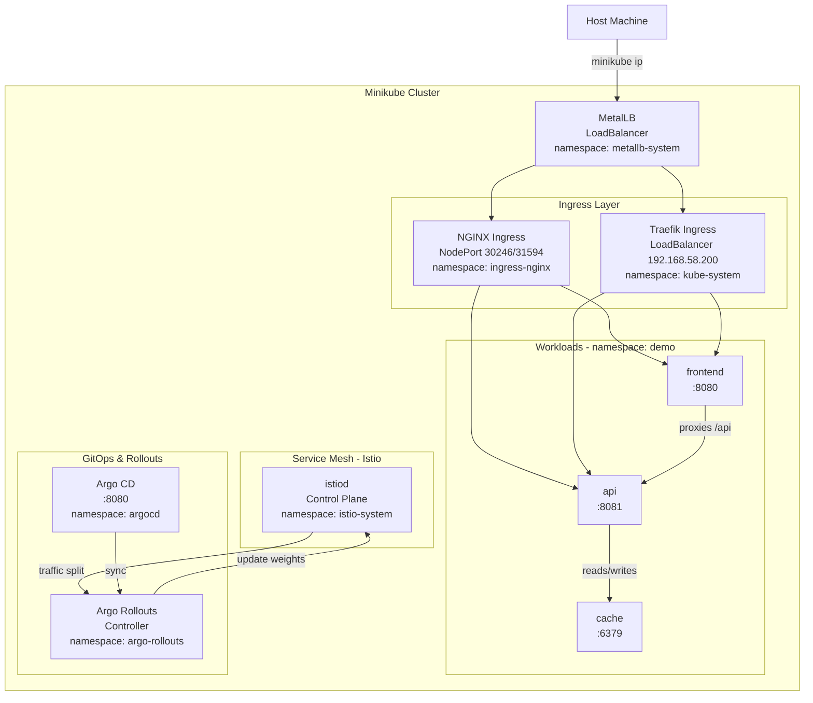
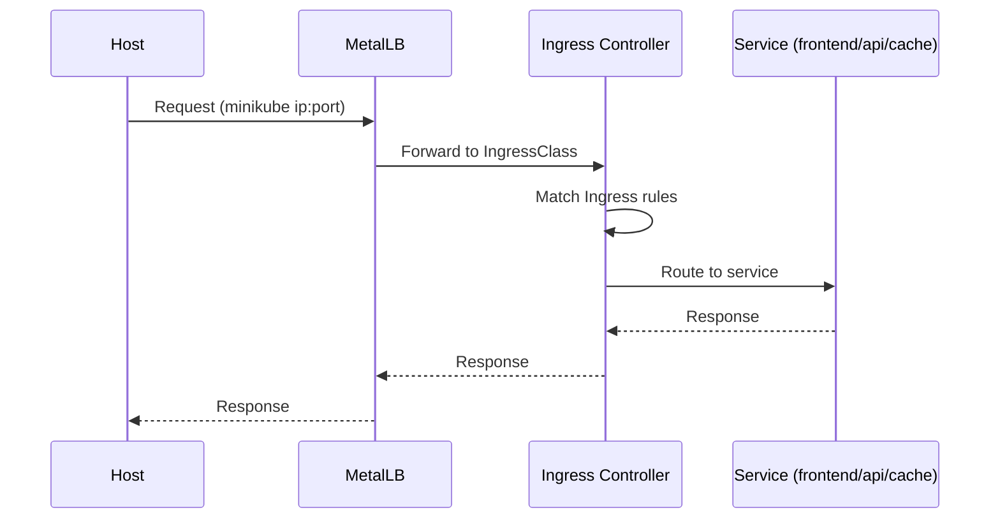
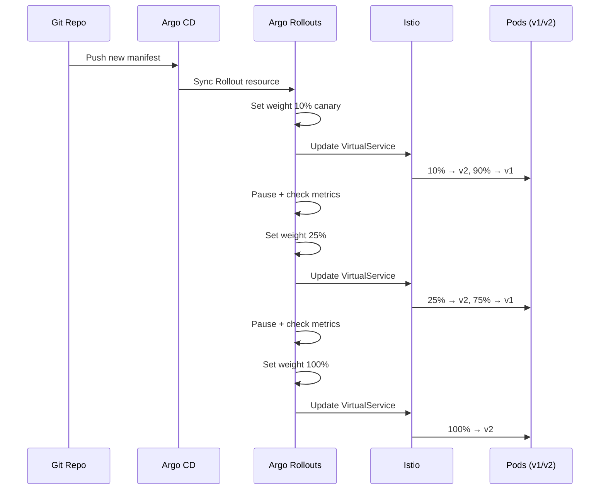

# Arquitectura del Playground

## Visión general

El playground simula un entorno de producción en miniatura con todas las capas necesarias para despliegues orquestados de microservicios.

## Diagrama de componentes



### Flujo de tráfico



### Flujo de despliegue progresivo (Canary)



## Namespaces

| Namespace | Propósito |
|---|---|
| `default` | Namespace por defecto |
| `ingress-nginx` | Controlador NGINX Ingress |
| `kube-system` | Traefik y addons del sistema |
| `istio-system` | Istiod y componentes Istio |
| `argocd` | Argo CD server y components |
| `argo-rollouts` | Argo Rollouts controller |
| `demo` | Aplicaciones de ejemplo |
| `metallb-system` | MetalLB controller |

## Recursos del clúster

```
Minikube (recomendado):
├── CPU: 4 cores
├── Memoria: 8GB
├── Disco: 20GB
└── Driver: docker (default)
```

## Puertos expuestos

| Puerto | Servicio | Acceso |
|---|---|---|
| 30246 | NGINX Ingress HTTP | `minikube ip:30246` |
| 31594 | NGINX Ingress HTTPS | `minikube ip:31594` |
| 80 | Traefik HTTP | `192.168.58.200` (LB) |
| 443 | Traefik HTTPS | `192.168.58.200` (LB) |
| 30000-32767 | NodePort Services | `minikube ip:<port>` |
| 8080 | Argo CD UI | `minikube service argocd-server -n argocd` |
| 9000 | Traefik Dashboard | `minikube service traefik -n kube-system` |

## Estrategias de despliegue

| Estrategia | Rollout | Services | VirtualService |
|---|---|---|---|
| **Canary** | `api-rollout-canary` | api-stable, api-canary | api-canary-vsvc |
| **Blue/Green** | `api-rollout-bluegreen` | api-active, api-preview | api-bluegreen-vsvc |
| **A/B Testing** | `api-rollout-ab` | api-ab-stable, api-ab-canary | api-ab-vsvc |

## Ingress rules

### NGINX Ingress

| Host | Servicio |
|---|---|
| `frontend.nginx.demo.local` | frontend:8080 |
| `api.nginx.demo.local` | api:8081 |
| `nginx.demo.local` | nginx-comparison:8080 |

### Traefik Ingress

| Host | Servicio |
|---|---|
| `frontend.traefik.demo.local` | frontend:8080 |
| `api.traefik.demo.local` | api:8081 |
| `traefik.demo.local` | nginx-comparison:8080 |
