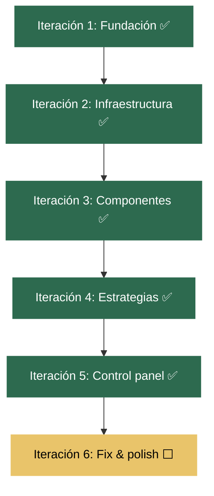

# User Stories - K8s Deployer Playground

## Leyenda de estados

- ✅ Completada
- 🔄 En progreso
- ⬜ Pendiente

---

## Diagrama de ejecución

---

## Iteración 1: Fundación del proyecto ✅

| US | Descripción | Estado |
|---|---|---|
| US-00 | Crear estructura de directorios | ✅ |
| US-01 | Documentación inicial (README, tech docs) | ✅ |
| US-02 | Scripts de setup/teardown automatizados | ✅ |
| US-03 | Profile de Minikube configurable | ✅ |
| US-04 | Sistema de logging e inventario | ✅ |
| US-05 | .gitignore y .env.example | ✅ |

### US-00: Crear estructura de directorios ✅

**Como** desarrollador del proyecto,
**quiero** tener la estructura de directorios definida,
**para** organizar los recursos de forma clara y consistente.

**Criterios de aceptación:**
- Directorios creados: `docs/`, `scripts/`, `apps/`, `argocd/`, `istio/`, `ingress/`
- Subdirectorios: `apps/microservices-demo/{base,canary,bluegreen,abtesting}`, `apps/nginx-comparison`, `ingress/{nginx,traefik}`
- Estructura coherente con el README

### US-01: Documentación inicial ✅

**Como** usuario del playground,
**quiero** tener documentación que explique cada tecnología y su papel,
**para** entender el propósito de cada componente antes de usarlo.

**Criterios de aceptación:**
- `README.md` con descripción, componentes, requisitos, inicio rápido
- `docs/tecnologias.md` describiendo Minikube, NGINX, Traefik, Istio, Argo CD, Argo Rollouts
- `docs/arquitectura.md` con diagramas de componentes
- `docs/estrategias-despliegue.md` explicando Canary, Blue/Green, A/B Testing
- `docs/guia-setup.md` con guía paso a paso

### US-02: Scripts de setup/teardown automatizados ✅

**Como** operador del playground,
**quiero** tener scripts que instalen y desinstalen todo el entorno automáticamente,
**para** no tener que ejecutar comandos uno por uno.

**Criterios de aceptación:**
- `scripts/setup.sh` instala: minikube, metallb, NGINX, traefik, istio, argo cd, argo rollouts
- `scripts/teardown.sh` elimina todo limpiamente
- Scripts de instalación individual para cada componente
- Funciones comunes en `scripts/helpers.sh`
- Scripts con permisos de ejecución

### US-03: Profile de Minikube configurable ✅

**Como** ingeniero con otros clústeres Minikube activos,
**quiero** poder configurar un nombre de profile diferente,
**para** no conflictar con otros entornos.

**Criterios de aceptación:**
- Variable de entorno `PLAYGROUND_PROFILE` (default: `k8s-playground`)
- Archivo `.env.example` como plantilla
- Scripts cargan `.env` si existe
- Validación de profile en uso antes de iniciar

### US-04: Sistema de logging e inventario ✅

**Como** operador del playground,
**quiero** que cada ejecución genere un log y un inventario,
**para** poder revisar qué se instaló y diagnosticar problemas.

**Criterios de aceptación:**
- Log en `logs/setup-YYYYMMDD-HHMMSS.log` con cada operación
- Inventario en `logs/inventario-YYYYMMDD-HHMMSS.md` con: namespaces, pods, servicios, versiones, IPs
- Funciones de logging en helpers.sh (log_info, log_success, log_warn, log_error)

### US-05: .gitignore y .env.example ✅

**Como** desarrollador del proyecto,
**quiero** tener un .gitignore que excluya archivos temporales y secretos,
**para** no commitear cosas que no deben ir al repositorio.

**Criterios de aceptación:**
- `.gitignore` excluye: `logs/`, `.env`, binarios, archivos de editores
- `.env.example` documenta todas las variables configurables

---

## Iteración 2: Infraestructura base ✅

| US | Descripción | Estado |
|---|---|---|
| US-06 | Instalar Minikube con addons | ✅ |
| US-07 | Configurar MetalLB | ✅ |
| US-08 | Instalar NGINX Ingress Controller | ✅ |
| US-09 | Instalar Istio | ✅ |
| US-10 | Instalar Argo CD | ✅ |
| US-11 | Fix kustomize build errors | ✅ |
| US-12 | Diagramas Mermaid.js | ✅ |

### US-06: Instalar Minikube con addons ✅

**Como** operador del playground,
**quiero** que el script de setup cree un clúster Minikube con los recursos adecuados,
**para** tener una base sólida para los demás componentes.

**Criterios de aceptación:**
- Minikube inicia con: 4 CPUs, 8GB RAM, 20GB disco
- Driver docker por defecto
- Kubernetes versión stable
- El clúster queda funcional y accesible

### US-07: Configurar MetalLB ✅

**Como** operador del playground,
**quiero** tener MetalLB configurado con un pool de IPs,
**para** que los servicios LoadBalancer tengan una IP externa accesible.

**Criterios de aceptación:**
- MetalLB instalado via addon de Minikube
- Pool de IPs configurado (`.200-.250` del rango del clúster)
- Webhook de MetalLB funciona (test con IPAddressPool temporal)
- L2Advertisement configurado

### US-08: Instalar NGINX Ingress Controller ✅

**Como** ingeniero que quiere probar Ingress controllers,
**quiero** tener NGINX Ingress funcionando,
**para** usarlo como controller de ingress principal.

**Criterios de aceptación:**
- Addon `ingress` habilitado en Minikube
- Pods en namespace `ingress-nginx` en estado Running
- IngressClass `nginx` disponible
- Puerto NodePort asignado (30246/31594)

### US-09: Instalar Istio ✅

**Como** ingeniero que quiere probar service mesh,
**quiero** tener Istio instalado con istiod,
**para** gestionar tráfico, mTLS y observabilidad.

**Criterios de aceptación:**
- istiod corriendo en namespace `istio-system`
- `istioctl` instalado y funcional
- Profile minimal instalado
- Labels de Istio disponibles para inyección

### US-10: Instalar Argo CD ✅

**Como** ingeniero que quiere practicar GitOps,
**quiero** tener Argo CD funcionando,
**para** sincronizar aplicaciones desde repositorios Git.

**Criterios de aceptación:**
- Todos los pods de Argo CD en namespace `argocd` Running
- UI accesible via `minikube service argocd-server -n argocd`
- CLI `argocd` instalada
- Contraseña admin generada y accesible

### US-11: Fix kustomize build errors ✅

**Como** desarrollador del proyecto,
**quiero** que `kubectl kustomize .` funcione sin errores,
**para** poder desplegar con `kubectl apply -k .`.

**Criterios de aceptación:**
- No hay Deployments duplicados con el mismo nombre
- IngressClass de Traefik usa controller path válido
- `commonLabels` reemplazado por `labels` (sin deprecation warning)
- `kubectl kustomize .`build limpio sin errores

### US-12: Diagramas Mermaid.js ✅

**Como** usuario del playground,
**quiero** tener diagramas visuales de la arquitectura,
**para** entender rápidamente cómo se conectan los componentes.

**Criterios de aceptación:**
- Diagrama de componentes (graph TB)
- Diagrama de flujo de tráfico (sequence diagram)
- Diagrama de despliegue Canary (sequence diagram)
- Se renderizan en GitHub/GitLab/VS Code

---

## Iteración 3: Componentes ✅

| US | Descripción | Estado |
|---|---|---|
| US-13 | Instalar Argo Rollouts controller | ✅ |
| US-14 | Instalar Traefik addon | ✅ |
| US-15 | Configurar Ingress resources | ✅ |
| US-16 | Configurar Istio Gateway + routing | ✅ |

### US-13: Instalar Argo Rollouts controller ✅

**Como** ingeniero que quiere practicar despliegues progresivos,
**quiero** que el controller de Argo Rollouts esté instalado,
**para** poder ejecutar estrategias Canary, Blue/Green y A/B Testing.

**Criterios de aceptación:**
- Namespace `argo-rollouts` creado
- Pods del controller en estado Running
- `kubectl argo rollouts version` conecta contra el clúster
- Integra con Istio para traffic splitting

### US-14: Instalar Traefik addon ✅

**Como** ingeniero que quiere comparar Ingress controllers,
**quiero** tener Traefik corriendo,
**para** comparar su comportamiento con NGINX Ingress.

**Criterios de aceptación:**
- Deployment de Traefik corriendo en `kube-system`
- IngressClass `traefik` funcionando
- NodePort asignado para acceso externo
- Dashboard de Traefik accesible

### US-15: Configurar Ingress resources ✅

**Como** usuario del playground,
**quiero** poder acceder a las apps via Ingress (NGINX y Traefik),
**para** verificar que el routing funciona correctamente.

**Criterios de aceptación:**
- Ingress `nginx-demo` accessible en `nginx.demo.local`
- Ingress `traefik-demo` accessible en `traefik.demo.local`
- `/` sirve frontend, `/api` sirve API
- Entradas a `/etc/hosts` documentadas

### US-16: Configurar Istio Gateway + routing ✅

**Como** ingeniero que quiere probar el service mesh,
**quiero** que el Gateway de Istio esté instalado y enrutando tráfico,
**para** usar VirtualServices y DestinationRules con las apps.

**Criterios de aceptación:**
- Gateway `playground-gateway` instalado en namespace `demo`
- VirtualServices `frontend-vsvc` y `api-vsvc` activos
- DestinationRules `frontend-dr` y `api-dr` activos
- Tráfico accesible via `istio-ingressgateway`

---

## Iteración 4: Estrategias de despliegue ✅

| US | Descripción | Estado |
|---|---|---|
| US-17 | Desplegar estrategia Canary | ✅ |
| US-18 | Desplegar estrategia Blue/Green | ✅ |
| US-19 | Desplegar estrategia A/B Testing | ✅ |

### US-17: Desplegar estrategia Canary ✅

**Como** ingeniero que quiere practicar despliegues canary,
**quiero** tener un Rollout configurado con estrategia Canary,
**para** observar el split de tráfico gradual.

**Criterios de aceptación:**
- Rollout `api-rollout-canary` creado
- AnalysisTemplate configurado con métricas Prometheus
- VirtualService para canary configurado
- `kubectl argo rollouts set image` funciona

### US-18: Desplegar estrategia Blue/Green ✅

**Como** ingeniero que quiere practicar despliegues blue/green,
**quiero** tener un Rollout configurado con estrategia Blue/Green,
**para** observar el swap completo entre versiones.

**Criterios de aceptación:**
- Rollout `api-rollout-bluegreen` creado
- Services `api-active` y `api-preview` funcionando
- AnalysisTemplate de smoke-test configurado
- `kubectl argo rollouts promote` funciona

### US-19: Desplegar estrategia A/B Testing ✅

**Como** ingeniero que quiere practicar experimentos A/B,
**quiero** tener un Rollout configurado con routing por headers,
**para** segmentar tráfico entre versiones.

**Criterios de aceptación:**
- Rollout `api-rollout-ab` creado
- VirtualService con match por header `x-user-group: beta`
- Requests con header van a canary, el resto a stable

---

## Iteración 5: Control panel y pulido ✅

| US | Descripción | Estado |
|---|---|---|
| US-20 | Crear control panel con URLs | ✅ |
| US-21 | Actualizar kustomization.yaml | ✅ |
| US-22 | Actualizar documentación final | ✅ |
| US-23 | Integrar Helm como prerequisito en scripts | ✅ |

### US-20: Crear control panel con URLs ✅

**Como** operador del playground,
**quiero** tener un panel de control centralizado con URLs de acceso a todas las UIs,
**para** acceder rápidamente a los dashboards sin buscar comandos.

**Criterios de aceptación:**
- Archivo `CONTROL-PANEL.md` con todas las URLs
- Incluye: Argo CD, Traefik Dashboard, Kiali, Argo Rollouts, Prometheus, Grafana
- Incluye IPs y puertos de acceso
- Incluye comandos `minikube service` para cada servicio
- Se genera/actualiza via script o se mantiene manual

**UIs a incluir:**

| UI | Cómo acceder | Puerto |
|---|---|---|
| Argo CD | `minikube service argocd-server -n argocd --url` | ClusterIP |
| Traefik Dashboard | `minikube service traefik -n kube-system --url` | NodePort |
| Kiali (Istio) | `istioctl dashboard kiali` | Port-forward |
| Argo Rollouts | `kubectl argo rollouts dashboard` | Port-forward |
| Prometheus | Port-forward a istio-system | 9090 |
| Grafana | Port-forward a istio-system | 3000 |

### US-21: Actualizar kustomization.yaml ✅

**Como** desarrollador del playground,
**quiero** que kustomize despliegue todos los recursos necesarios,
**para** poder hacer `kubectl apply -k .` y tener todo funcionando.

**Criterios de aceptación:**
- kustomization.yaml incluye todos los recursos nuevos
- No hay errores de build
- Se puede desplegar todo de una vez

### US-22: Actualizar documentación final ✅

**Como** usuario del playground,
**quiero** que la documentación refleje el estado actual del proyecto,
**para** entender qué hay instalado y cómo usarlo.

**Criterios de aceptación:**
- `docs/tecnologias.md` con versiones reales instaladas
- `docs/guia-setup.md` refleja los comandos que funcionan
- `docs/arquitectura.md` incluye los componentes realmente existentes
- Diagramas Mermaid actualizados
- README con enlace a User Stories

### US-23: Integrar Helm como prerequisito en scripts ✅

**Como** operador del playground,
**quiero** que Helm se instale automáticamente como prerequisito,
**para** que los scripts de instalación de Traefik y NGINX funcionen sin intervención manual.

**Criterios de aceptación:**
- Función `install_helm()` en `scripts/helpers.sh`
- `setup.sh` instala Helm en la sección de prerequisitos
- `setup.sh` instala Traefik via Helm (no via addon de Minikube)
- `install-traefik.sh` e `install-ingress-nginx.sh` usan la función helper
- `docs/guia-setup.md` lista Helm como prerequisito requerido con pasos de instalación
- `.env.example` incluye `HELM_VERSION` como opción comentada

---

## Iteración 6: Fix & polish ⬜

| US | Descripción | Estado |
|---|---|---|
| US-24 | Fix Argo CD placeholder + sincronizar versiones en docs | ✅ |
| US-25 | Unificar scripts setup.sh + install-*.sh | ✅ |
| US-26 | Fix docs menores (iteraciones, guía, control panel, teardown) | ✅ |
| US-27 | Instalar Kiali/Prometheus/Grafana en setup.sh | ⬜ |

### US-24: Fix Argo CD placeholder + sincronizar versiones en docs ✅

**Como** usuario del playground,
**quiero** que los repositorios de Argo CD apunten a URLs reales y las versiones estén sincronizadas entre docs,
**para** que Argo CD pueda sincronizar correctamente y la documentación sea fiable.

**Criterios de aceptación:**
- `argocd/application.yaml` usa URL placeholder configurable (no `your-org`)
- `README.md` muestra versiones reales (no v1.38.1 para Minikube)
- `README.md` referencia estructura de directorios correcta
- Todas las docs muestran las mismas versiones

### US-25: Unificar scripts setup.sh + install-*.sh ✅

**Como** operador del playground,
**quiero** que los scripts individuales reutilicen la misma lógica que setup.sh,
**para** mantener una sola fuente de verdad y evitar inconsistencias.

**Criterios de aceptación:**
- `setup.sh` consume variables `.env` para versiones (ISTIO_VERSION, ARGO_CD_VERSION, etc.)
- Scripts individuales usan `install_helm()` y funciones de helpers.sh
- Configuración de recursos (CPU/memory) coherente entre scripts
- MetalLB IP range configurable via `.env`

### US-26: Fix docs menores ✅

**Como** usuario del playground,
**quiero** que la guía manual, el control panel y el teardown sean consistentes con setup.sh,
**para** seguir cualquier camino sin contradicciones.

**Criterios de aceptación:**
- `docs/guia-setup.md` usa `--profile` en minikube start
- `docs/guia-setup.md` usa MetalLB via addon (no manifest v0.14.9)
- `docs/guia-setup.md` incluye flags de Istio consistentes con setup.sh
- `CONTROL-PANEL.md` usa `$(minikube ip)` en vez de IPs hardcodeadas
- `CONTROL-PANEL.md` incluye NGINX en tabla de acceso rápido
- `scripts/teardown.sh` limpia Helm releases de Traefik/NGINX

### US-27: Instalar Kiali/Prometheus/Grafana en setup.sh ⬜

**Como** usuario del playground,
**quiero** tener Kiali, Prometheus y Grafana instalados automáticamente,
**para** acceder a dashboards de observabilidad sin configuración manual.

**Criterios de aceptación:**
- `setup.sh` instala addons de Istio (Kiali, Prometheus, Grafana)
- `CONTROL-PANEL.md` incluye URLs de acceso a estos dashboards
- Docs actualizadas con estos componentes
